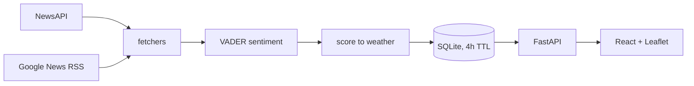

# Emotion Weather Map

A weather map of the news. Twelve countries, scored on the mood of their current
headlines and drawn as weather — sun for good news, overcast for flat news,
thunderstorms for bad. Click a country and the camera flies in; the pin breaks
apart into cities that fill in one by one.


## Running it

You need Python 3.11+ and Node 18+.

```bash
./dev.sh          # macOS / Linux
.\dev.ps1         # Windows PowerShell
```

That handles the virtual environment, both installs, and starting both servers.
Then open <http://localhost:5173>. `Ctrl+C` stops everything.


### About the API key

Grab a free one from [newsapi.org](https://newsapi.org/register) and paste it into
`backend/.env`. But it's optional — countries NewsAPI can't serve fall back to a
Google News RSS search, which needs no key at all. The panel tells you which
source each reading came from. A key buys you better country data, not the
difference between working and broken.

Never put the key in `.env.example`. That file gets committed; `.env` doesn't.

---

## How it works



Headlines come in, get deduplicated, scored one by one, and averaged. That average
lands in one of five bands and becomes the region's weather. Everything is cached
for four hours, which is what keeps a free-tier API key alive under real traffic.

Two sources, because no free news API offers a city parameter and no RSS search
reproduces a country's front page. Details in
[docs/methodology.md](docs/methodology.md) and
[docs/architecture.md](docs/architecture.md).

---

## API

| Endpoint | Returns |
| --- | --- |
| `/api/countries` | All twelve, with condition and score |
| `/api/countries/{code}` | Headlines driving the score, 7-day trend, cities |
| `/api/cities/{city}?country={code}` | City condition, score, headlines |
| `/api/global-summary` | Planet mood, brightest and darkest country |
| `/api/health` | Cache state — first place to look when the map is blank |

---

## Tests

```bash
cd backend  && python -m pytest    # 124
cd frontend && npm test            # 32
```

The score-to-weather mapping is tested exhaustively, since it's pure logic over a
bounded range. The cache's four-hour refresh rule is tested with an injected clock
rather than a real four-hour wait. RSS parsing runs against a saved feed, so no
test touches the network.

The map itself needs a real browser, so there's a manual checklist at the bottom
of [docs/architecture.md](docs/architecture.md).

---

## What this isn't

**It doesn't measure public opinion.** It measures the mood of what editors chose
to publish, read one sentence at a time by a model that doesn't understand
sarcasm. Newsrooms select for conflict everywhere, so every country reads darker
than it lives. Comparing countries to each other is meaningful; reading a single
score as a verdict on a place is not.

**It only stores headlines and source names.** No article bodies, which keeps it
inside the terms of most free news tiers.

**Twelve countries is on purpose.** Global coverage would multiply the API usage
and the testing surface without making the idea any clearer.

---
