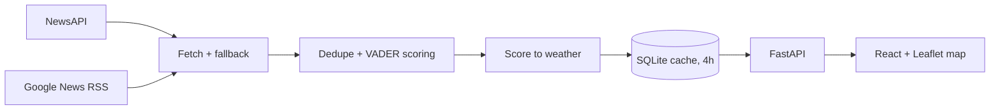

# Emotion Weather Map

> A world map that turns news-headline sentiment into weather — sun for good news,
> storms for bad — across 12 countries and 57 cities, rebuilt live from Google News
> every four hours.

**[Live demo](https://emotion-weather-map.vercel.app)** · **[Source](https://github.com/makkergauri/Emotion-Weather-Map)**

---

## The problem

Sentiment analysis usually ends in a table of numbers, and nobody reads a table of
numbers for fun. Comparing the tone of news across countries means reading dozens of
feeds at once. On top of that, free news APIs are rate-limited, uneven in which
countries they cover, and offer no city-level search at all.

## Approach

Weather is a scale everyone already reads without a legend, so each region's average
headline sentiment is mapped onto one of five conditions and drawn on a map. The key
engineering decisions sit behind that:

- **Two sources with a fallback.** NewsAPI serves country front pages. Google News RSS
  covers cities, which no free API offers, and takes over for any country NewsAPI has
  no coverage for. Each reading records which source it came from, and the UI shows it.
- **A cache that makes free tiers workable.** Readings are stored in SQLite for four
  hours, so external calls scale with time rather than with visitors.
- **Failure that stays honest.** An unreachable region shows as a grey "no data" pin,
  never as a misleading neutral reading, and a failed fetch never overwrites a good one.



## Results

| Metric | Value | How it was measured |
|---|---|---|
| Coverage | 12 countries, 57 cities | Count of entries in `backend/data/regions.json` |
| Backend tests | 124 passing | `python -m pytest` in `backend/` |
| Frontend tests | 36 passing | `npm test` in `frontend/` |
| Max NewsAPI usage | 72 requests/day | 12 countries × 6 refreshes a day at the 4-hour TTL; the TTL boundary is covered by tests using an injected clock |
| JS bundle | 385 kB (120 kB gzipped) | `npm run build` output in `frontend/` |

**How to reproduce:** run the two test commands above; `npm run build` prints the
bundle size.

There's no accuracy figure, deliberately. There's no labelled ground truth for "the
mood of a country's news", so any accuracy number would be invented. What's tested
instead is the pipeline's behaviour: the score-to-weather mapping (exhaustively),
caching, RSS parsing against a saved feed, and graceful degradation when sources fail.

**Limitations:**

- **Headline sentiment is not public opinion.** It's the tone of what editors chose to
  publish, and newsrooms select for conflict, so every country reads darker than it
  lives. Comparing countries is meaningful; one score in isolation isn't.
- **VADER reads words, not context.** It misses sarcasm and negation, and only handles
  English, which skews coverage of Japan, Brazil, Germany and France.
- **The weather thresholds are hand-set**, reasoned in `docs/methodology.md` rather than
  validated against data.
- **Free hosting:** the backend can take up to a minute to wake after idling, and the
  cache resets on each deploy, so the 7-day trend strip restarts empty.

## Tech stack

- **Backend:** Python 3.11, FastAPI, httpx, feedparser, VADER sentiment (optional
  DistilBERT mode), SQLite, pytest
- **Frontend:** React 18, TypeScript, Vite, Leaflet via react-leaflet, Vitest and
  Testing Library
- **Deployment:** Render (backend), Vercel (frontend), a GitHub Actions keep-alive ping
- **Data:** Google News RSS, NewsAPI (optional), CARTO basemap tiles

## Running it

Prerequisites: Python 3.11+, Node 18+. A [NewsAPI key](https://newsapi.org/register)
and a [CARTO key](https://carto.com/basemaps/apikey) are both free and both optional:
without NewsAPI every region uses RSS, and without CARTO the map tiles carry a
watermark.

```bash
git clone https://github.com/makkergauri/Emotion-Weather-Map.git
cd Emotion-Weather-Map

# Backend
cd backend
python -m venv .venv
source .venv/bin/activate        # Windows: .venv\Scripts\activate
pip install -r requirements.txt
cp .env.example .env             # optionally add NEWS_API_KEY
uvicorn app.main:app --reload

# Frontend, in a second terminal
cd frontend
npm install
npm run dev                      # open http://localhost:5173
```

Or run `./dev.sh` (macOS/Linux) or `.\dev.ps1` (Windows) from the root to start both.
Deployment steps are in `docs/deploying.md`.
